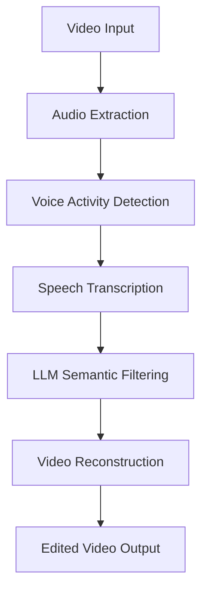

# Veditor - Intelligent Video Editing Pipeline


GitHub Repository: [https://github.com/Eeman1113/veditor.git](https://github.com/Eeman1113/veditor.git)

## Project Overview

Veditor is an intelligent video editing system that automates content curation through multi-stage processing. The system combines voice activity detection, speech recognition, and large language models (LLMs) to identify and remove redundant segments from video content. Key features include:

- Audio extraction and voice activity detection (VAD)
- Speech-to-text transcription using OpenAI Whisper
- Semantic deduplication using GPT-4o via LangChain
- Video segment recombination with MoviePy
- Batch processing capabilities

## System Architecture

The system follows a modular pipeline architecture with six primary components:



### Core Components

1. **Audio Processor** (`extract_audio`, `detect_segments`)
   - Converts video to mono audio (16-bit PCM, 16kHz)
   - Implements WebRTC VAD with configurable aggressiveness
   - Handles audio frame processing (10-30ms windows)

2. **Speech Transcriber** (`transcribe_audio_segment`)
   - Utilizes OpenAI Whisper API for accurate transcription
   - Processes audio segments in temporary WAV files

3. **Semantic Filter** (`get_llm_suggestion`)
   - Employs GPT-4o via LangChain's structured output parser
   - Implements context-aware deduplication logic

4. **Video Editor** (`create_final_video`)
   - Uses MoviePy for frame-accurate video cutting
   - Implements non-destructive editing with concatenation

## Workflow Explanation

### Step 1: Audio Extraction
- Converts input video to WAV format using MoviePy
- Preserves original sampling rate where possible
- Output: `[basename]_temp_audio.wav`

### Step 2: Voice Activity Detection
- Processes audio in configurable frames (default: 30ms)
- Implements three-stage processing:
  1. Frame-level speech detection (WebRTC VAD)
  2. Segment merging with adjustable padding (default: 300ms)
  3. Post-speech padding (default: 200ms) for natural cuts
- Output: `[basename]_raw_segments.json`

### Step 3: Speech Transcription
- Processes detected segments through Whisper API
- Maintains temporal alignment with original video
- Handles audio chunking through temp files
- Output: `[basename]_transcription.json`

### Step 4: Semantic Filtering
- LangChain prompt engineering for structured output:
  ```python
  prompt = '''
  Filtering Rules:
  1. Remove segments with ≥90% text similarity
  2. Prefer later occurrences of repeated content
  3. Preserve contextual flow
  4. Remove non-speech artifacts
  '''
  ```
- Uses response schema validation
- Fallback to raw segments on parsing errors
- Output: `[basename]_suggestion.json`

### Step 5: Video Reconstruction
- Precise frame extraction with MoviePy
- Multi-segment concatenation with libx264/aac encoding
- Output: `edited/[original_filename]_processed.mp4`

## Code Structure

### Core Functions

```python
def detect_segments(audio, frame_duration_ms=30, ...):
    """
    VAD Implementation Details:
    - Converts audio to WebRTC-compatible format
    - Implements frame-wise speech detection
    - Merges segments with dynamic padding
    - Handles edge cases (partial frames, sample rate mismatches)
    """
```

```python
def get_llm_suggestion(raw_transcription):
    """
    LLM Interaction Flow:
    1. Defines output schema with ResponseSchema
    2. Constructs instructional prompt with examples
    3. Uses temperature=0 for deterministic output
    4. Implements fallback mechanism on parse errors
    """
```

### Configuration Parameters

| Parameter | Default | Description |
|-----------|---------|-------------|
| `frame_duration_ms` | 30 | VAD analysis window size |
| `padding_duration_ms` | 300 | Max silence between segments to merge |
| `aggressiveness` | 3 | VAD detection strictness (0-3) |
| `post_speech_padding_sec` | 0.2 | Buffer after speech ends |

## Setup & Installation

### Requirements
- Python 3.9+
- OpenAI API key (set as `OPENAI_API_KEY` environment variable)
- FFmpeg (for MoviePy operations)

```bash
# Install dependencies
pip install -r requirements.txt

# Directory structure
mkdir -p raw edited
```

### Configuration
```python
# Adjust in detect_segments() call:
process_video(video_path):
    ...
    raw_segments = detect_segments(
        audio, 
        frame_duration_ms=100,  # Custom frame size
        aggressiveness=2,       # Less strict detection
        post_speech_padding_sec=0.5
    )
```

## Usage

1. Place input videos in `raw/` directory
2. Execute main script:
```bash
python veditor.py
```
3. Find processed videos in `edited/` directory

## Performance Considerations

- **Audio Processing**: 16kHz mono audio uses ~256kbps bandwidth
- **VAD Efficiency**: 30ms frames process 1hr audio in ~2s
- **Whisper API**: 30s segments take ~5s each
- **LLM Latency**: GPT-4o averages 2-4s per suggestion

## Limitations & Future Work

**Current Limitations**
- Dependency on OpenAI API for transcription/LLM
- Single-threaded processing
- Limited to audio-based segmentation

**Planned Enhancements**
- Local Whisper implementation
- Visual scene change detection
- Multi-GPU processing support
- Interactive preview interface

## References

- WebRTC VAD: https://github.com/wiseman/py-webrtcvad
- OpenAI Whisper: https://openai.com/research/whisper
- LangChain: https://python.langchain.com
- MoviePy: https://zulko.github.io/moviepy/

